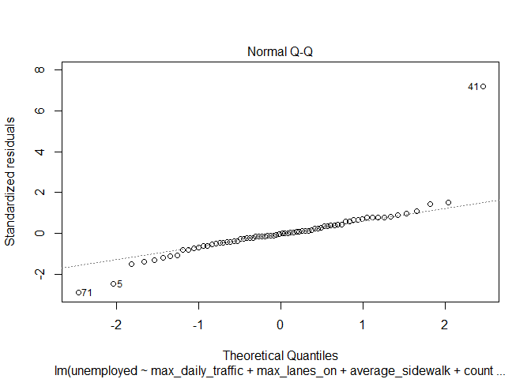
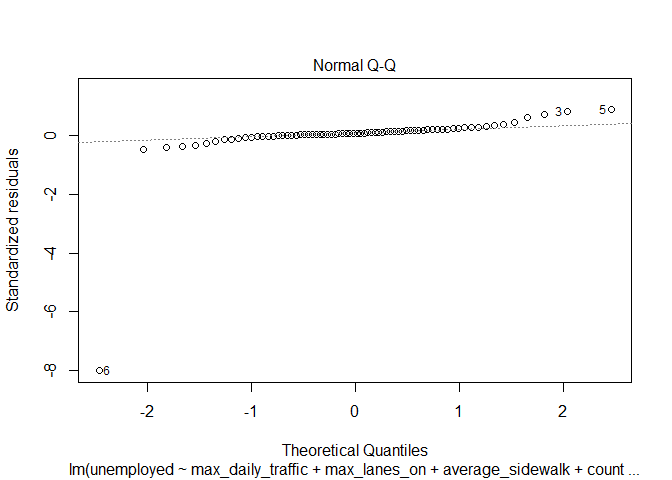

Homework 2: Bridges and Unemployment
================
Lucas Stormowski
2/27/2020

``` r
rm(list = ls())
library(blscrapeR)
library(tidyverse)
```

    ## -- Attaching packages ------------------------------------------------------------------------- tidyverse 1.3.0 --

    ## v ggplot2 3.2.1     v purrr   0.3.3
    ## v tibble  2.1.3     v dplyr   0.8.3
    ## v tidyr   1.0.2     v stringr 1.4.0
    ## v readr   1.3.1     v forcats 0.4.0

    ## -- Conflicts ---------------------------------------------------------------------------- tidyverse_conflicts() --
    ## x dplyr::filter() masks stats::filter()
    ## x dplyr::lag()    masks stats::lag()

``` r
library(dplyr)
library(data.table)
```

    ## 
    ## Attaching package: 'data.table'

    ## The following objects are masked from 'package:dplyr':
    ## 
    ##     between, first, last

    ## The following object is masked from 'package:purrr':
    ## 
    ##     transpose

``` r
df <- get_bls_county()
WIunemployment = df %>% filter(fips_state == 55)
bridges = read_csv("https://www.fhwa.dot.gov/bridge/nbi/2018/delimited/WI18.txt")
```

    ## Parsed with column specification:
    ## cols(
    ##   .default = col_double(),
    ##   STRUCTURE_NUMBER_008 = col_character(),
    ##   ROUTE_NUMBER_005D = col_character(),
    ##   HIGHWAY_DISTRICT_002 = col_character(),
    ##   COUNTY_CODE_003 = col_character(),
    ##   FEATURES_DESC_006A = col_character(),
    ##   CRITICAL_FACILITY_006B = col_logical(),
    ##   FACILITY_CARRIED_007 = col_character(),
    ##   LOCATION_009 = col_character(),
    ##   LRS_INV_ROUTE_013A = col_character(),
    ##   LAT_016 = col_character(),
    ##   LONG_017 = col_character(),
    ##   MAINTENANCE_021 = col_character(),
    ##   OWNER_022 = col_character(),
    ##   FUNCTIONAL_CLASS_026 = col_character(),
    ##   DESIGN_LOAD_031 = col_character(),
    ##   RAILINGS_036A = col_character(),
    ##   TRANSITIONS_036B = col_character(),
    ##   APPR_RAIL_036C = col_character(),
    ##   APPR_RAIL_END_036D = col_character(),
    ##   NAVIGATION_038 = col_character()
    ##   # ... with 41 more columns
    ## )

    ## See spec(...) for full column specifications.

``` r
bridges = bridges %>% 
  group_by(COUNTY_CODE_003) %>% 
  summarize(count = n(),deck = mean(as.numeric(DECK_COND_058), na.rm = T),
            super = mean(as.numeric(SUPERSTRUCTURE_COND_059), na.rm=T),
            sub = mean(as.numeric(SUBSTRUCTURE_COND_060), na.rm=T),
            channel = mean(as.numeric(CHANNEL_COND_061), na.rm=T),   
            culvert = mean(as.numeric(CULVERT_COND_062), na.rm=T),
            average_daily_traffic = mean(as.numeric(ADT_029)),
            max_daily_traffic = max(as.numeric(ADT_029)),
            average_lanes_on = mean(as.numeric(TRAFFIC_LANES_ON_028A)),
            max_lanes_on = mean(as.numeric(TRAFFIC_LANES_ON_028A)),
            average_sidewalk = mean(as.numeric(LEFT_CURB_MT_050A)),
            average_bridge_improvement_cost = mean(as.numeric(BRIDGE_IMP_COST_094)),
            average_road_improvement_cost = mean(as.numeric(ROADWAY_IMP_COST_095))
            ) %>% 
  left_join(WIunemployment,by = c("COUNTY_CODE_003" = "fips_county")) 
unemployed_model_using_average = lm(unemployed ~ average_daily_traffic + average_lanes_on + average_sidewalk + count, data=bridges)
summary(unemployed_model_using_average)
```

    ## 
    ## Call:
    ## lm(formula = unemployed ~ average_daily_traffic + average_lanes_on + 
    ##     average_sidewalk + count, data = bridges)
    ## 
    ## Residuals:
    ##     Min      1Q  Median      3Q     Max 
    ## -2239.1  -421.7   -90.5   424.7  4874.7 
    ## 
    ## Coefficients:
    ##                         Estimate Std. Error t value Pr(>|t|)    
    ## (Intercept)           -3.188e+03  3.417e+03  -0.933  0.35413    
    ## average_daily_traffic  2.560e-01  9.623e-02   2.660  0.00977 ** 
    ## average_lanes_on       1.011e+03  1.777e+03   0.569  0.57136    
    ## average_sidewalk       1.477e+03  1.090e+03   1.354  0.18020    
    ## count                  5.653e+00  9.408e-01   6.008 8.59e-08 ***
    ## ---
    ## Signif. codes:  0 '***' 0.001 '**' 0.01 '*' 0.05 '.' 0.1 ' ' 1
    ## 
    ## Residual standard error: 917.1 on 67 degrees of freedom
    ## Multiple R-squared:  0.8349, Adjusted R-squared:  0.8251 
    ## F-statistic: 84.71 on 4 and 67 DF,  p-value: < 2.2e-16

``` r
unemployed_model_using_max = lm(unemployed ~ max_daily_traffic + max_lanes_on + average_sidewalk + count, data=bridges)
summary(unemployed_model_using_max)
```

    ## 
    ## Call:
    ## lm(formula = unemployed ~ max_daily_traffic + max_lanes_on + 
    ##     average_sidewalk + count, data = bridges)
    ## 
    ## Residuals:
    ##     Min      1Q  Median      3Q     Max 
    ## -2569.9  -408.0   -29.7   371.9  5017.9 
    ## 
    ## Coefficients:
    ##                     Estimate Std. Error t value Pr(>|t|)    
    ## (Intercept)       -8.951e+03  2.142e+03  -4.178 8.69e-05 ***
    ## max_daily_traffic  1.366e-02  8.284e-03   1.649 0.103777    
    ## max_lanes_on       4.007e+03  1.122e+03   3.572 0.000661 ***
    ## average_sidewalk   2.129e+03  1.075e+03   1.981 0.051752 .  
    ## count              4.933e+00  1.097e+00   4.496 2.81e-05 ***
    ## ---
    ## Signif. codes:  0 '***' 0.001 '**' 0.01 '*' 0.05 '.' 0.1 ' ' 1
    ## 
    ## Residual standard error: 945.3 on 67 degrees of freedom
    ## Multiple R-squared:  0.8246, Adjusted R-squared:  0.8141 
    ## F-statistic: 78.75 on 4 and 67 DF,  p-value: < 2.2e-16

``` r
plot(unemployed_model_using_max)
```

 For my model I have chosen to use the 4 variables daily lane traffic, lanes on the bridge, the total number of bridges and the average sidewalk width. For one model I use the max of the daily lane traffic and the max of the lanes on the bridge. In the other model I use the average instead. I wanted to see how these 2 models compared. The model that uses the max is a better indicator of the total of unemployed because of its higher R-value. Both max lanes and number of bridges are statistically significant. However, I have chosen to keep the average sidewalk and max daily traffic in the model for greater accuracy. If we look at the graph of the residuals we see that the model is not perfect, but for a model as elementary as this I believe our variables provide a good estimator of the total unemployed. Our model says that if the max daily traffic of a bridge in a county is high, it will increase the predicted number of unemployed people. The same is true for max lanes on a bridge and the average size of the sidewalk. I believe this is due to these bridges with high traffic being in highly populated areas where unemployed numbers will be high no matter what the unemployment rate is because so many people live there.

``` r
unemployment_rate_model = lm(unemployed_rate ~ average_road_improvement_cost + average_bridge_improvement_cost + count + sub + super, data=bridges)
summary(unemployment_rate_model)
```

    ## 
    ## Call:
    ## lm(formula = unemployed_rate ~ average_road_improvement_cost + 
    ##     average_bridge_improvement_cost + count + sub + super, data = bridges)
    ## 
    ## Residuals:
    ##     Min      1Q  Median      3Q     Max 
    ## -1.7072 -0.6934 -0.1149  0.5070  1.8885 
    ## 
    ## Coefficients:
    ##                                   Estimate Std. Error t value Pr(>|t|)    
    ## (Intercept)                      4.9615878  3.1379473   1.581 0.119474    
    ## average_road_improvement_cost    2.9103548  1.6035624   1.815 0.074891 .  
    ## average_bridge_improvement_cost -0.2872447  0.1600765  -1.794 0.078144 .  
    ## count                           -0.0035034  0.0008742  -4.008 0.000183 ***
    ## sub                             -1.0045993  0.6633903  -1.514 0.135563    
    ## super                            0.9179419  0.7087501   1.295 0.200581    
    ## ---
    ## Signif. codes:  0 '***' 0.001 '**' 0.01 '*' 0.05 '.' 0.1 ' ' 1
    ## 
    ## Residual standard error: 0.8961 on 56 degrees of freedom
    ##   (10 observations deleted due to missingness)
    ## Multiple R-squared:  0.3255, Adjusted R-squared:  0.2652 
    ## F-statistic: 5.404 on 5 and 56 DF,  p-value: 4e-04

``` r
plot(unemployment_rate_model)
```

 I have decided to use the variables average road improvement cost, average bridge improvement cost, the number of bridges, the condition of the substructure and the superstructure to predict my unemployment rate. The variables that are significant at 10% significance are the average road improvement cost, average bridge improvement cost and the total number of bridges in that county. I tried my model with all of the condition ratings, however, it appeared that the only relevant ones were the condition of the superstructure and substructure, hence why I kept them. Finally, looking at our residual plot it appears are residuals are normally distributed and our model does not skew any way. This linear model is not as strong as the one that predicts the total unemployed at an R-squared of 0.3255. This means our model is not the greatest predictor of unemployment rate but it is better than nothing. Our model does say that a high average road improvement cost will increase the predicted unemployment rate. I do not have a theory why this is. Conversely, a higher bridge improvement cost would result in a lower predicted unemployment rate. A good substructure condition indicates a lower unemployment rates, whereas a better condition superstructure would cause the unemployment rate prediction to go up.

``` r
dfNov <- get_bls_county("November 2019")
WIunemploymentNov = df %>% filter(fips_state == 55)

WIunemploymentNov = WIunemploymentNov[,c(3,8,9)]

bridges_with_nov = WIunemploymentNov %>% 
  rename(unemployment_rate_nov = unemployed_rate)%>%
  rename(county_nov = fips_county)%>%
  rename(unemployed_nov = unemployed)%>%
  left_join(bridges,by = c("county_nov" = "COUNTY_CODE_003"))
```

This combines Novembers unemployment rates and unemployment numbers to our already existing dataset. Below I will now use the same models but adding in the previous months numbers as predictors.

``` r
unemployed_model = lm(unemployed ~ max_daily_traffic + max_lanes_on + average_sidewalk + count + unemployed_nov, data=bridges_with_nov)
summary(unemployed_model)
```

    ## 
    ## Call:
    ## lm(formula = unemployed ~ max_daily_traffic + max_lanes_on + 
    ##     average_sidewalk + count + unemployed_nov, data = bridges_with_nov)
    ## 
    ## Residuals:
    ##        Min         1Q     Median         3Q        Max 
    ## -8.005e-12  9.700e-15  7.790e-14  1.830e-13  8.336e-13 
    ## 
    ## Coefficients:
    ##                     Estimate Std. Error    t value Pr(>|t|)    
    ## (Intercept)        9.918e-12  2.588e-12  3.832e+00 0.000286 ***
    ## max_daily_traffic -1.916e-17  9.094e-18 -2.107e+00 0.038889 *  
    ## max_lanes_on      -4.391e-12  1.317e-12 -3.334e+00 0.001406 ** 
    ## average_sidewalk  -2.371e-12  1.190e-12 -1.992e+00 0.050554 .  
    ## count             -5.277e-15  1.347e-15 -3.918e+00 0.000215 ***
    ## unemployed_nov     1.000e+00  1.315e-16  7.606e+15  < 2e-16 ***
    ## ---
    ## Signif. codes:  0 '***' 0.001 '**' 0.01 '*' 0.05 '.' 0.1 ' ' 1
    ## 
    ## Residual standard error: 1.017e-12 on 66 degrees of freedom
    ## Multiple R-squared:      1,  Adjusted R-squared:      1 
    ## F-statistic: 6.597e+31 on 5 and 66 DF,  p-value: < 2.2e-16

``` r
plot(unemployed_model)
```

 As suspected, adding November's data for makes our model a much better predictor. This is because it does not change much from month to month. This gives us a great predictor from month to month. It has a very, very small p- value and is by far our most reliable predictor out of the reast of our variables.

``` r
unemployment_rate_model = lm(unemployed_rate ~ average_road_improvement_cost + average_bridge_improvement_cost + count + sub + super + unemployment_rate_nov, data=bridges_with_nov)
summary(unemployment_rate_model)
```

    ## 
    ## Call:
    ## lm(formula = unemployed_rate ~ average_road_improvement_cost + 
    ##     average_bridge_improvement_cost + count + sub + super + unemployment_rate_nov, 
    ##     data = bridges_with_nov)
    ## 
    ## Residuals:
    ##        Min         1Q     Median         3Q        Max 
    ## -2.353e-16 -2.402e-17  4.201e-18  2.894e-17  1.465e-16 
    ## 
    ## Coefficients:
    ##                                  Estimate Std. Error   t value Pr(>|t|)
    ## (Intercept)                     0.000e+00  2.281e-16 0.000e+00        1
    ## average_road_improvement_cost   0.000e+00  1.174e-16 0.000e+00        1
    ## average_bridge_improvement_cost 0.000e+00  1.171e-17 0.000e+00        1
    ## count                           0.000e+00  7.053e-20 0.000e+00        1
    ## sub                             0.000e+00  4.814e-17 0.000e+00        1
    ## super                           0.000e+00  5.116e-17 0.000e+00        1
    ## unemployment_rate_nov           1.000e+00  9.504e-18 1.052e+17   <2e-16
    ##                                    
    ## (Intercept)                        
    ## average_road_improvement_cost      
    ## average_bridge_improvement_cost    
    ## count                              
    ## sub                                
    ## super                              
    ## unemployment_rate_nov           ***
    ## ---
    ## Signif. codes:  0 '***' 0.001 '**' 0.01 '*' 0.05 '.' 0.1 ' ' 1
    ## 
    ## Residual standard error: 6.373e-17 on 55 degrees of freedom
    ##   (10 observations deleted due to missingness)
    ## Multiple R-squared:      1,  Adjusted R-squared:      1 
    ## F-statistic: 2.736e+33 on 6 and 55 DF,  p-value: < 2.2e-16

``` r
plot(unemployment_rate_model)
```

 I am not quite sure what happened here, but it appears that the unemployment rate from November is the same in December. This means our model is perfect in predicting the December unemployment rate. I am unsure if this is because they failed to obtain new data or my left join command did not work properly.
